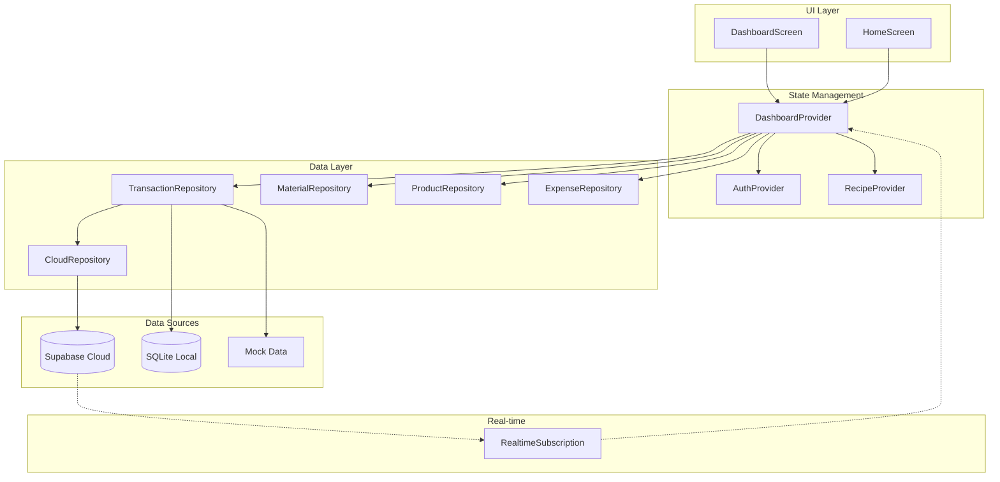

# Design Document: Dashboard Comprehensive Fix

## Overview

Dokumen ini menjelaskan desain teknis untuk perbaikan komprehensif halaman Dashboard pada aplikasi POS Kasir Multitenant. Perbaikan mencakup:

1. **Error Handling yang Robust** - Penanganan error yang lebih baik dengan fallback mechanism
2. **Multi-tenant Data Isolation** - Memastikan data terisolasi per tenant dan branch
3. **Offline/Online Mode** - Dukungan penuh untuk operasi offline dengan sync ke cloud
4. **Real-time Updates** - Integrasi Supabase real-time subscription untuk auto-refresh
5. **Responsive Layout** - Layout yang adaptif untuk berbagai ukuran layar

## Architecture



## Components and Interfaces

### 1. DashboardProvider (Enhanced)

```dart
/// Enhanced Dashboard Provider with real-time support
class DashboardNotifier extends StateNotifier<DashboardData> {
  // Real-time subscription channels
  RealtimeChannel? _transactionChannel;
  RealtimeChannel? _materialChannel;
  RealtimeChannel? _expenseChannel;

  // Connection status
  bool _isOnline = false;

  /// Initialize with real-time subscriptions
  Future<void> initialize() async;

  /// Subscribe to real-time updates from Supabase
  Future<void> _setupRealtimeSubscriptions(String tenantId) async;

  /// Handle transaction changes from real-time
  void _onTransactionChange(Map<String, dynamic> payload);

  /// Handle material changes from real-time
  void _onMaterialChange(Map<String, dynamic> payload);

  /// Handle expense changes from real-time
  void _onExpenseChange(Map<String, dynamic> payload);

  /// Cleanup subscriptions on dispose
  @override
  void dispose();
}
```

### 2. DashboardData (Enhanced)

```dart
/// Enhanced Dashboard Data with connection status
class DashboardData {
  final double todaySales;
  final int todayTransactionCount;
  final double todayExpenses;
  final double todayCostOfGoodsSold;
  final List<Transaction> recentTransactions;
  final List<ProductionCapacity> productionCapacities;
  final int canProduceCount;
  final int outOfStockCount;
  final int lowStockMaterialCount;
  final bool isLoading;
  final String? error;
  final bool isOnline;  // NEW: Connection status
  final DateTime? lastUpdated;  // NEW: Last update timestamp

  // Computed properties
  double get grossProfit;
  double get grossProfitMarginPercent;
  double get netProfit;
  bool get hasData;
  bool get hasTransactions;
}
```

### 3. ConnectionStatusWidget (New)

```dart
/// Widget to display online/offline status
class ConnectionStatusWidget extends StatelessWidget {
  final bool isOnline;
  final DateTime? lastSynced;
  final VoidCallback? onRetry;
}
```

### 4. DashboardScreen (Enhanced)

```dart
/// Enhanced Dashboard Screen with connection indicator
class DashboardScreen extends ConsumerWidget {
  // Add connection status indicator in AppBar
  // Add real-time update indicator
  // Improve error handling UI
}
```

## Data Models

### DashboardData State

| Field                 | Type                     | Description                        |
| --------------------- | ------------------------ | ---------------------------------- |
| todaySales            | double                   | Total penjualan hari ini           |
| todayTransactionCount | int                      | Jumlah transaksi hari ini          |
| todayExpenses         | double                   | Total biaya hari ini               |
| todayCostOfGoodsSold  | double                   | Harga pokok penjualan hari ini     |
| recentTransactions    | List<Transaction>        | 5 transaksi terbaru                |
| productionCapacities  | List<ProductionCapacity> | Kapasitas produksi per produk      |
| canProduceCount       | int                      | Jumlah produk yang bisa diproduksi |
| outOfStockCount       | int                      | Jumlah produk yang bahan habis     |
| lowStockMaterialCount | int                      | Jumlah bahan dengan stok rendah    |
| isLoading             | bool                     | Status loading                     |
| error                 | String?                  | Pesan error jika ada               |
| isOnline              | bool                     | Status koneksi                     |
| lastUpdated           | DateTime?                | Waktu update terakhir              |

### ProductionCapacity

| Field            | Type    | Description                                  |
| ---------------- | ------- | -------------------------------------------- |
| product          | Product | Produk yang dihitung                         |
| canProduce       | int     | Jumlah yang bisa diproduksi (-1 = no recipe) |
| isOutOfStock     | bool    | Apakah bahan habis                           |
| limitingMaterial | String? | Bahan yang membatasi produksi                |

## Correctness Properties

_A property is a characteristic or behavior that should hold true across all valid executions of a system-essentially, a formal statement about what the system should do. Properties serve as the bridge between human-readable specifications and machine-verifiable correctness guarantees._

### Property 1: Tenant Data Isolation

_For any_ dashboard data load with a given tenant ID, all returned transactions, materials, products, and expenses SHALL belong to that tenant ID only.
**Validates: Requirements 2.1, 2.3, 2.4, 2.5**

### Property 2: Branch Data Filtering

_For any_ dashboard data load with a given branch ID, all returned data SHALL be filtered by both tenant ID and branch ID when branch ID is provided.
**Validates: Requirements 2.2**

### Property 3: Sales Statistics Accuracy

_For any_ set of transactions for a given date, the dashboard's todaySales SHALL equal the sum of all transaction totals, and todayTransactionCount SHALL equal the count of transactions.
**Validates: Requirements 5.1, 5.2**

### Property 4: Profit Calculation Correctness

_For any_ dashboard data, grossProfit SHALL equal (todaySales - todayCostOfGoodsSold) and netProfit SHALL equal (todaySales - todayExpenses).
**Validates: Requirements 5.3, 5.4**

### Property 5: Profit Margin Formatting

_For any_ dashboard data with todaySales > 0, grossProfitMarginPercent SHALL equal (grossProfit / todaySales \* 100) rounded to one decimal place.
**Validates: Requirements 5.5**

### Property 6: Production Capacity Calculation

_For any_ product with a recipe, the production capacity SHALL be limited by the material with the lowest (stock / required_quantity) ratio.
**Validates: Requirements 6.1, 6.5**

### Property 7: Out of Stock Detection

_For any_ product with a recipe, if any required material has stock = 0, the product SHALL be marked as out of stock.
**Validates: Requirements 6.2**

### Property 8: Capacity Count Accuracy

_For any_ dashboard data, canProduceCount + outOfStockCount SHALL equal the total number of products with recipes defined.
**Validates: Requirements 6.3, 6.4**

### Property 9: Low Stock Threshold Detection

_For any_ material with minStock defined, if stock <= minStock, the material SHALL be counted in lowStockMaterialCount.
**Validates: Requirements 7.1, 7.2, 7.5**

### Property 10: Low Stock Warning Visibility

_For any_ dashboard data, the low stock warning section SHALL be visible if and only if lowStockMaterialCount > 0.
**Validates: Requirements 7.4**

### Property 11: Recent Transactions Limit and Order

_For any_ dashboard data, recentTransactions SHALL contain at most 5 transactions, ordered by createdAt descending.
**Validates: Requirements 8.1**

### Property 12: Transaction Display Completeness

_For any_ transaction in recentTransactions, the display SHALL include item count, payment method, total amount, and formatted time.
**Validates: Requirements 8.2**

### Property 13: Time Formatting Rules

_For any_ transaction, if createdAt is within 24 hours, display relative time; otherwise display date format.
**Validates: Requirements 8.4, 8.5**

### Property 14: Graceful Fallback on Cloud Failure

_For any_ dashboard load where Supabase connection fails, the dashboard SHALL load data from local storage without displaying error if local data is available.
**Validates: Requirements 3.2, 4.5**

### Property 15: Responsive Grid Layout

_For any_ screen width < 600px, the statistics grid SHALL display 2 columns; for width >= 600px, it SHALL display 4 columns.
**Validates: Requirements 10.1, 10.2**

### Property 16: Real-time Update Propagation

_For any_ new transaction created in Supabase, the dashboard SHALL refresh and include the new transaction in calculations within 5 seconds.
**Validates: Requirements 4.2, 9.1**

## Error Handling

### Error Categories

1. **Network Errors**

   - Supabase connection timeout
   - Network unavailable
   - API rate limiting

2. **Data Errors**

   - Invalid tenant ID
   - Corrupted local data
   - Missing required fields

3. **State Errors**
   - Provider not initialized
   - Auth state missing
   - Recipe provider not ready

### Error Recovery Strategy

```dart
/// Error recovery with exponential backoff
class ErrorRecovery {
  static const maxRetries = 3;
  static const baseDelay = Duration(seconds: 1);

  Future<T> withRetry<T>(Future<T> Function() operation) async {
    int attempts = 0;
    while (attempts < maxRetries) {
      try {
        return await operation();
      } catch (e) {
        attempts++;
        if (attempts >= maxRetries) rethrow;
        await Future.delayed(baseDelay * pow(2, attempts));
      }
    }
    throw Exception('Max retries exceeded');
  }
}
```

### Fallback Chain

```
1. Try Supabase (if enabled)
   ↓ (on failure)
2. Try Local SQLite (if not web)
   ↓ (on failure)
3. Try Mock Data (if web)
   ↓ (on failure)
4. Show Error State with Retry
```

## Testing Strategy

### Dual Testing Approach

Testing akan menggunakan kombinasi:

1. **Unit Tests** - Untuk fungsi-fungsi spesifik dan edge cases
2. **Property-Based Tests** - Untuk memverifikasi correctness properties

### Property-Based Testing Library

Menggunakan `fast_check` package untuk Dart:

```yaml
dev_dependencies:
  fast_check: ^0.0.5
```

### Test Configuration

- Minimum 100 iterations per property test
- Each test tagged with property reference from design document
- Format: `**Feature: dashboard-comprehensive-fix, Property {number}: {property_text}**`

### Unit Test Coverage

1. **DashboardProvider Tests**

   - loadDashboardData with valid tenant
   - loadDashboardData with null tenant
   - loadDashboardData with empty tenant ID
   - refresh functionality
   - real-time subscription setup

2. **Calculation Tests**

   - Gross profit calculation
   - Net profit calculation
   - Profit margin percentage
   - Production capacity calculation

3. **UI Tests**
   - Loading state display
   - Error state display
   - Empty state display
   - Responsive layout breakpoints

### Property-Based Test Coverage

Each correctness property (1-16) will have a corresponding property-based test that:

- Generates random valid inputs
- Verifies the property holds for all generated inputs
- Reports counterexamples on failure
